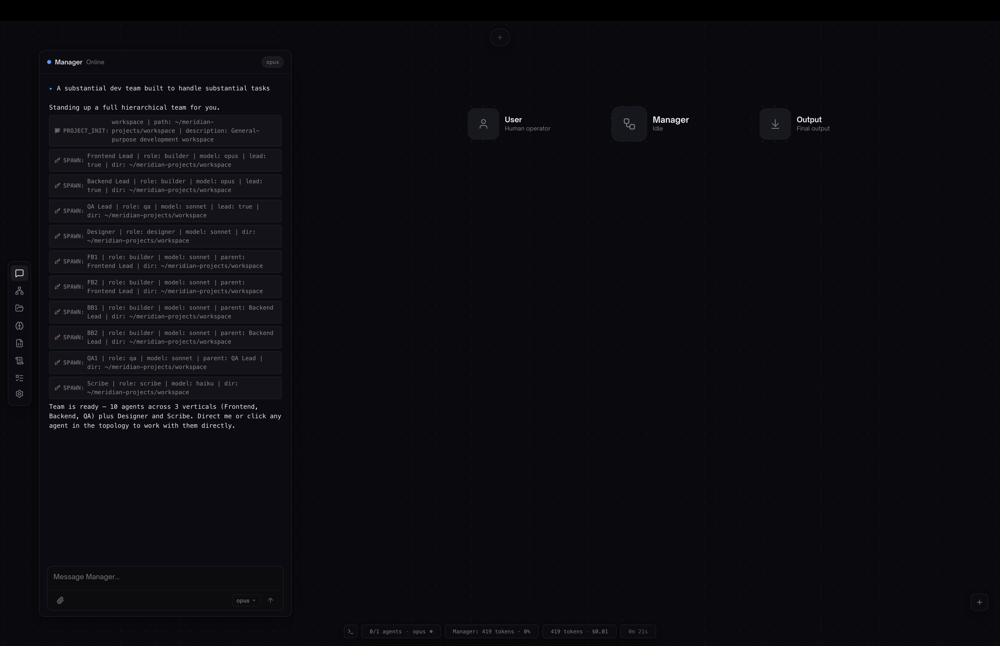
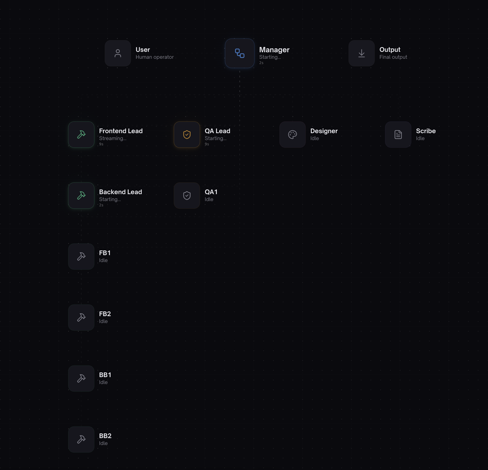
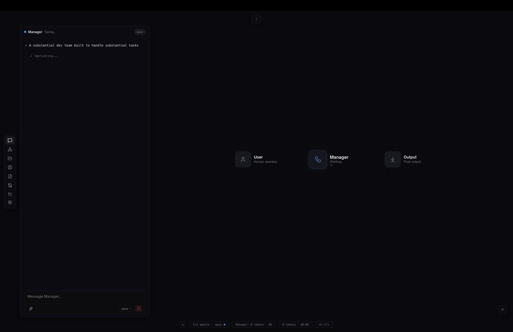
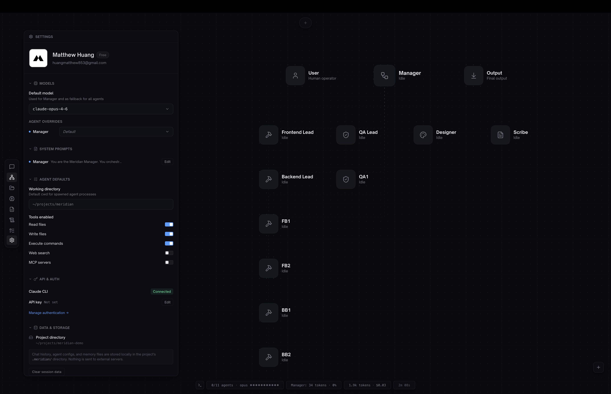
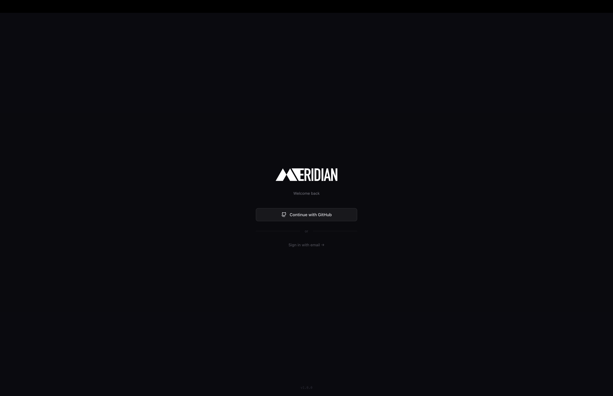
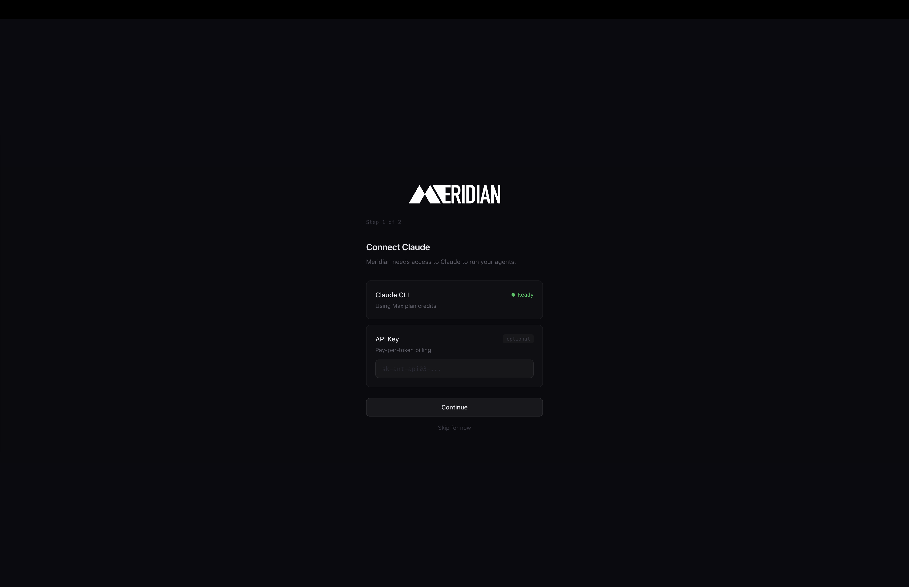
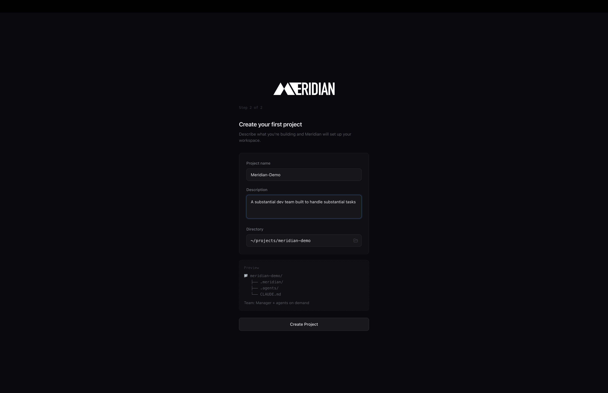

<p align="center">
  
</p>

<h1 align="center">Meridian</h1>

<p align="center">
  <strong>The multi-agent orchestration platform for AI-native developers.</strong>
</p>

<p align="center">
  Replace yourself as the communication bus between parallel coding agents.
</p>

<p align="center">
  
  
  
  
</p>

<br />

<p align="center">
  
</p>

<br />

---

## The Problem

You run Claude Code, Codex, Gemini CLI — maybe 3-10 agents in parallel across terminal tabs. Each one is powerful on its own.

**But you are the bottleneck.**

You read output from one agent. Copy context to another. Decide who works on what. Resolve conflicts. Relay messages. Manage state. The agents are fast. You are the slowest link in the chain.

Some tools claim to solve this with CLI wrappers, YAML configs, and buzzword architectures. They'll tell you they have "Q-learning routers" and "Byzantine consensus" and "neural self-optimization." But when you actually try to use them, nothing happens — because the agents are just state objects in memory, not real processes doing real work.

**Meridian takes a different approach.** Every agent is a real subprocess. Every message is actually delivered. Every node on the topology is a live process you can watch, talk to, pause, or kill. No theater. No simulated orchestration. Just agents that actually run.

---

## What Meridian Does

Meridian is a native desktop app that removes you from the middle.

You talk to **one agent** — the **Manager**. Manager handles everything else: analyzing your request, deploying the right team, routing work between agents, and reporting back when it's done.

You see everything happening in real time on a **visual topology**. One chat. Full visibility. No context-switching. No YAML. No config files. No learning a CLI.

<br />

| Without Meridian | With Meridian |
|:---|:---|
| 6 terminal tabs open | 1 app window |
| Copy-pasting between agents | Automatic routing |
| You decide who does what | Manager decides |
| You resolve merge conflicts | Manager handles git |
| Context lost across sessions | Scribe remembers everything |
| Agents don't know about each other | Full inter-agent communication |
| Reading docs to configure agent YAML | Describe your project in English |

<br />

---

## Features

### Visual Agent Topology

<p align="center">
  
</p>

Real-time org chart of your agent team rendered on Canvas 2D. Each node shows the agent's role, status, and model. Connection lines animate when agents communicate — idle dash crawl, active packet animation. Top-down layout with Manager at the center, leads below, sub-agents beneath.

This isn't a text log you scroll through. It's a live, visual map of your entire agent team — what they're doing, who they're talking to, and whether they're healthy. **No other multi-agent tool has this.** Not as a CLI flag. Not as a dashboard. Not as an afterthought. It's the core of the experience.

<br />

### Real Agents, Not State Objects

Every agent in Meridian is a **real CLI subprocess** — a full Claude Code, Codex, or Gemini process with its own working directory, config, and lifecycle. When an agent "writes code," it's actually writing code. When it "runs tests," tests actually run.

This matters more than you think. Some orchestrators manage agents as in-memory objects — they track state, update JSON files, and claim "100+ agents" while nothing actually executes. Meridian spawns real processes, monitors them with health checks, and restarts them with exponential backoff if they crash. You can watch the process count in Activity Monitor.

<br />

### One Chat, Full Control

<p align="center">
  
</p>

Talk to Manager in natural language. Manager dispatches to the right agents, collects results, and reports back. GitHub Copilot-style input with model selector, file attachments, and full markdown rendering.

Every relay between agents is visible. You see exactly what Manager told the Builder, what the Builder responded, and what QA found. No black box. No "trust the swarm."

<br />

### Dynamic Team Composition

There is no static agent list. No YAML files to configure. No "agent definitions" to write. **Manager is the only default agent.** When you describe your project, Manager assembles the right team:

| Project Type | Team Deployed |
|:---|:---|
| Backend-heavy | Manager + 3 Builders + QA + Scribe |
| Frontend/design-heavy | Manager + Builder + 2 Designers + QA + Scribe |
| Quick fix | Manager + Builder |
| Full-stack | Manager + 2 Builders + Designer + QA + Scribe |

Agents appear on the topology as they're deployed. Manager can add, remove, or reassign agents mid-project based on what's needed. You don't pre-configure your team — you describe your goal and the team materializes.

<br />

### Shared Structured Memory (Scribe)

Scribe runs silently in the background, reading **all** communication between agents. It logs everything to the project filesystem — decisions, code changes, conversations, corrections. Human-readable markdown, not opaque vector databases.

When Manager forgets context from 50 messages ago, Scribe surfaces it instantly. It's your project's institutional knowledge — the thing that makes agent teams actually work across long sessions. And because it's plain text on disk, you can read it yourself, search it with grep, or sync it to Obsidian. No proprietary binary format. No "memory engine" you can't inspect.

<br />

### Model-Agnostic

Not locked to one provider. Run **Claude Code**, **OpenAI Codex**, **Gemini CLI**, or any CLI-based coding agent.

Mix models across your team — Opus for Manager, Sonnet for Builders, GPT-4 for review. The right model for each job, not a one-size-fits-all lock-in. Most multi-agent tools only work with one provider. Meridian works with any CLI agent that reads stdin and writes stdout.

<br />

### Human-in-the-Loop

You see everything. Every relay between agents, every decision Manager makes, every correction loop.

Intervene anytime:
- Redirect work to a different agent
- Adjust an agent's behavior mid-task ("I don't like how the designer writes CSS")
- Pause or kill an agent
- Override Manager's routing

Manager rewrites agent configs on the fly based on your feedback. The agents adapt to you, not the other way around.

Autonomous agent swarms sound cool in demos. In practice, you want a kill switch. Meridian gives you one — plus full visibility into what's happening before you need to use it.

<br />

### Messages That Actually Arrive

Meridian's communication layer is built on **53 typed IPC channels** between the Electron main process and the renderer. When Manager sends a task to a Builder, it arrives. When a sub-agent reports to its lead, the lead gets it. When a lead compiles results and sends them to Manager, Manager receives them.

This sounds basic — and it should be. But inter-agent communication is where most orchestrators fall apart. Meridian has been through 14 end-to-end tests, including a 20-agent stress test with hierarchical routing (sub-agents → leads → Manager). Messages don't get lost. Agents don't talk past each other. The communication bus works because it was tested relentlessly, not theorized about.

<br />

### Built-in Terminal

Run your app without leaving Meridian. Full shell access, embedded in the app. See your agents build it, then run it — same window.

<br />

### Industrial-Luxury Interface

<p align="center">
  
</p>

Mission control meets Linear. Near-black base, agent-specific accent colors, glassmorphic panels, precise typography. Information-dense but clean. Every pixel considered.

Built with the same attention to craft as the tools you already use — GitHub, Linear, Vercel, Raycast. Not a CLI with a `--pretty` flag. Not a web dashboard bolted on after the fact. A native desktop app designed from day one to be the interface.

<br />

---

## How It Works

### 1. Sign in

<p align="center">
  
</p>

GitHub OAuth or email. One click. No config files. No environment variables. No `npx init`.

### 2. Connect your AI provider

<p align="center">
  
</p>

Meridian detects your Claude CLI automatically. Optionally add an API key for pay-per-token billing. Two options, one screen, done.

### 3. Describe your project

<p align="center">
  
</p>

Name it, describe what you're building, pick a directory. Meridian scaffolds the workspace with `.meridian/`, `.agents/`, and a `CLAUDE.md`. No YAML agent definitions to write. No topology configs to learn. Just tell it what you're building.

### 4. Manager assembles the team

<p align="center">
  
</p>

Manager reads your description and deploys the right agents — Frontend Lead, Backend Lead, QA, Designer, Scribe, and sub-agents under each lead. Each one is a real CLI process with its own working directory. You watch the org chart populate in real time.

### 5. Watch, iterate, ship

<p align="center">
  
</p>

Agents code, review, and test. Manager orchestrates. Connection lines animate as messages flow. Ask for changes — Manager dispatches, agents fix, Manager reports. Everything is committed to GitHub automatically.

<br />

---

## Architecture

```
┌──────────────────────────────────────────────────────┐
│                    Meridian App                       │
│                                                      │
│  ┌─────────────┐      ┌───────────────────────────┐  │
│  │  Electron    │      │   React 19 + Canvas 2D    │  │
│  │  Main        │      │                           │  │
│  │  Process     │ IPC  │  Topology · Chat ·        │  │
│  │             ◄──────►│  Terminal · Settings ·     │  │
│  │  Agent       │  53  │  Vault · Status Bar       │  │
│  │  Spawner     │ chan  │                           │  │
│  └──────┬──────┘      └───────────────────────────┘  │
│         │                                            │
│  ┌──────┴────────────────────────────────────────┐   │
│  │              Agent Processes                   │   │
│  │                                                │   │
│  │  Manager · Builder · Designer · QA · Scribe    │   │
│  │  (Claude Code / Codex / Gemini / Any CLI)      │   │
│  └────────────────────────────────────────────────┘   │
└──────────────────────────────────────────────────────┘
```

- **Electron** — native desktop performance, direct CLI process spawning via `child_process`
- **React 19 + TypeScript + Tailwind CSS 4** — modern UI with domain-specific Zustand stores
- **Canvas 2D** — lightweight topology rendering (not WebGL — small bundle, fast paint)
- **53 IPC channels** — typed, validated bridge between renderer and main process
- **Each agent is a real CLI subprocess** — isolated working directory, killable, restartable, with health monitoring and exponential backoff

No in-memory agent simulation. No JSON file state management pretending to be orchestration. Real processes, real IPC, real results.

<br />

---

## How Meridian Compares

|  | Meridian | Claude Code Teams | Claude Squad | Opcode | Agentrooms |
|:---|:---:|:---:|:---:|:---:|:---:|
| Multi-agent orchestration | **Yes** | Experimental | No | No | Limited |
| Visual topology | **Yes** | No | No | No | No |
| Dynamic team composition | **Yes** | No | No | No | No |
| Real agent subprocesses | **Yes** | Yes | Yes | Yes | Partial |
| Shared memory (Scribe) | **Yes** | No | No | No | No |
| Model-agnostic | **Yes** | No | No | Claude only | Limited |
| Native desktop app | **Yes** | CLI | TUI | Tauri | Web |
| Human-in-the-loop | **Yes** | Limited | Yes | Yes | Limited |
| Tested at 20 agents | **Yes** | No | No | No | No |

<br />

---

## Roadmap

### Shipped (v1.0.0)
- [x] Visual agent topology with real-time status
- [x] Dynamic team composition via Manager
- [x] Scribe agent for shared structured memory
- [x] Multi-model support (Claude, Codex, any CLI agent)
- [x] 7-phase animated onboarding flow
- [x] Supabase auth (GitHub OAuth + email)
- [x] Chat persistence and auto-scroll
- [x] Embedded terminal
- [x] Agent config editor and customization
- [x] Auto-updater
- [x] Hierarchical team routing (sub-agents report to leads)
- [x] Self-healing agents (retry, backoff, model fallback)
- [x] Context rotation (auto session dump at 85% usage)
- [x] 14 end-to-end tests passed, including 20-agent stress test

### Coming Soon
- [ ] Multi-computer orchestration (run agents across multiple machines)
- [ ] Obsidian vault integration for project memory
- [ ] Git integration UI (commit, push, pull from within app)
- [ ] Windows + Linux support

### Future
- [ ] Community workflow templates (shareable agent team configs)
- [ ] Agent marketplace
- [ ] Voice control
- [ ] Team collaboration (multiple humans, shared project)

<br />

---

## Pricing

### Free — forever
Everything on a single machine. No limits. No trials. No feature gates.
Full orchestration, all agents, all models, all features.

### Pro — coming later
Multi-computer orchestration. Run agents across your laptop and build server simultaneously.
Cloud sync. Team features.

*We believe the single-machine experience should be completely free. You only pay when you need to scale beyond one computer.*

<br />

---

## Built With

<p>
  
  
  
  
  
  
</p>

<br />

---

## Download

### macOS (Apple Silicon)

<!-- Link to GitHub Release once DMG is uploaded -->
**Coming soon** — v1.0.0 release in progress.

> Meridian is currently unsigned (Apple Developer Program enrollment pending).
> On first launch: **Right-click the app > Open > Click "Open"** in the dialog.
> Or run: `xattr -cr /Applications/Meridian.app`

<br />

---

<p align="center">
  <code>476+ commits · 119 source files · 53 IPC channels · 56 React components</code>
  <br />
  <code>5 domain stores · 14 end-to-end tests · 20-agent stress test cleared</code>
  <br /><br />
  <strong>Stop being the bottleneck.</strong>
  <br /><br />
  <sub>Created by <a href="https://github.com/Fresh1289">Matthew Huang</a></sub>
</p>
